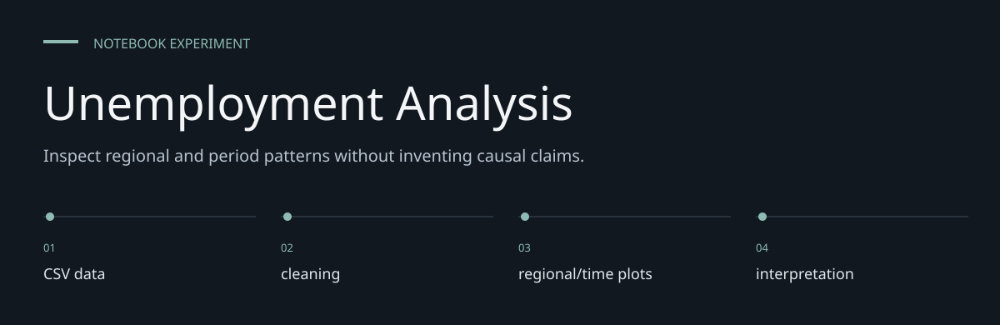
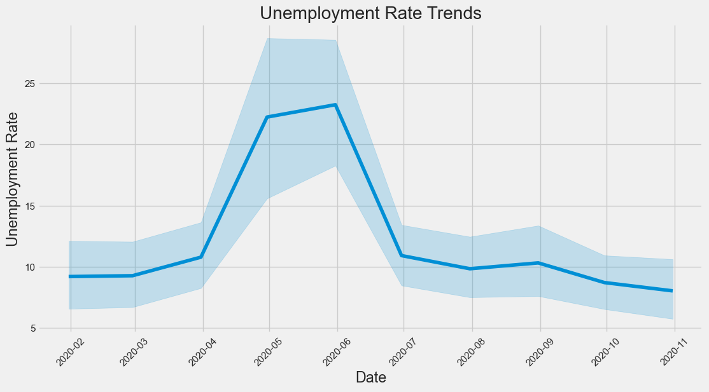

# Unemployment Analysis

**Inspect regional and period patterns without inventing causal claims.**

An exploratory notebook comparing unemployment patterns across Indian regions and dates.
It visualizes two supplied datasets; it does not train a forecasting model.


[Architecture](docs/ARCHITECTURE.md) · [Evaluation guide](docs/EVALUATION.md)

**Contents:** [The challenge](#the-challenge) · [Walkthrough](#walk-through-the-project) ·
[Implementation](#implementation-state) · [Design choices](#engineering-choices) ·
[Next evidence](#next-evidence-to-collect)

---

## The challenge

Two historical unemployment datasets provide an approachable way to inspect the relationship
between inputs and Descriptive comparisons. This repository keeps that work in a notebook so
preparation, computation and saved outputs can be read together. Its value is an inspectable
experiment, not a deployed prediction service.



*Historical output embedded in [Task_2.ipynb](Task_2.ipynb), cell 20. Extracted unchanged from the
notebook; not a fresh experiment result.*

## System at a glance


## Walk through the project

### 1. Supply the input data

The required CSV files are not tracked. Obtain an authorized copy with the expected schema and
replace the author-specific absolute paths before execution.

### 2. Inspect the preparation

Column names are normalized before analysis. Review the transformations and exclusions before
rerunning; an output cannot be understood separately from its input preparation.

### 3. Run the experiment

The implemented method is Pandas and plotting. Invalid date strings are coerced to missing values.
Execute in a fresh kernel to reveal ordering and dependency problems.

### 4. Read the diagnostics

Saved cleaned shapes show 740 and 267 rows. Period comparisons around March 2020 are descriptive,
not a causal model or current economic forecast. Dropna changes the analyzed sample and needs
inspection.

## What is in the repository

[Task_2.ipynb](Task_2.ipynb) contains cleaning, regional comparisons, time-series plots and
before/after March 2020 summaries. Saved outputs show 740 rows in the first cleaned dataset
and 267 in the second. These are historical notebook outputs, not a fresh data verification.

## Run the analysis

```bash
git clone https://github.com/DanushArun/Unemployment-Analysis.git
cd Unemployment-Analysis
python3 -m venv .venv
source .venv/bin/activate
python -m pip install jupyter pandas numpy matplotlib seaborn
jupyter notebook Task_2.ipynb
```

Supply `Unemployment in India.csv` and `Unemployment_Rate_upto_11_2020.csv` separately.
Neither dataset is committed. Replace the author's absolute CSV paths before running cells.
Dependencies are not pinned, so package versions can affect reproducibility.

## Analysis flow

1. Load the two CSV files and normalize column names.
2. Parse dates, replace infinite values and remove missing rows.
3. Plot changes over time and compare regions.
4. Compare observations before and after March 2020.

The date parser coerces invalid dates to missing values. Cleaning therefore changes the
sample; inspect removed records before drawing conclusions.

## Evidence and limits

Notebook JSON and Python cell syntax were checked for this documentation update.
The analysis was not rerun because its input files are absent.

Regional averages and period comparisons describe the supplied samples. They do not establish
that a particular event caused unemployment changes, and they are not current economic data.
There is no automated test suite, deployment service or trained prediction artifact here.

## Engineering choices

**Inputs are explicit.** region, date, unemployment-rate fields, labor-force fields where supplied.

**Method is inspectable.** Pandas and plotting is the implemented method; no broader modeling
capability is inferred.

**Historical evidence is labeled.** Saved cleaned shapes show 740 and 267 rows. Period comparisons
around March 2020 are descriptive, not a causal model or current economic forecast.

## Implementation state

| State | Current evidence |
| --- | --- |
| Present | Notebook source and historical saved outputs |
| Required externally | Authorized CSV input and compatible Python packages |
| Not rerun | Data-dependent execution in this documentation pass |
| Not supplied | Deployment service, model registry or automated behavior suite |

The [architecture guide](docs/ARCHITECTURE.md) maps these statements to source entry points.
The [evaluation guide](docs/EVALUATION.md) separates inspection, executable checks and
domain validation, with the next evidence needed for each project.

## Next evidence to collect

- Supply data provenance and a reproducible local path.
- Record a fresh-kernel run with package versions.
- Evaluate stability across independent samples before widening any performance claim.
