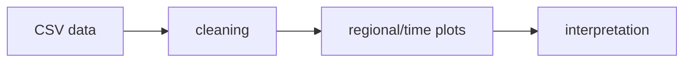

# Unemployment Analysis — Architecture and implementation

This guide follows the tracked implementation. Proposed work is identified separately.

## The problem and the system boundary

Two historical unemployment datasets provide an approachable way to inspect the relationship
between inputs and Descriptive comparisons. This repository keeps that work in a notebook so
preparation, computation and saved outputs can be read together. Its value is an inspectable
experiment, not a deployed prediction service.

## Processing path

## End-to-end behavior

### 1. Supply the input data

The required CSV files are not tracked. Obtain an authorized copy with the expected schema and
replace the author-specific absolute paths before execution.

### 2. Inspect the preparation

Column names are normalized before analysis. Review the transformations and exclusions before
rerunning; an output cannot be understood separately from its input preparation.

### 3. Run the experiment

The implemented method is Pandas and plotting. Invalid date strings are coerced to missing values.
Execute in a fresh kernel to reveal ordering and dependency problems.

### 4. Read the diagnostics

Saved cleaned shapes show 740 and 267 rows. Period comparisons around March 2020 are descriptive,
not a causal model or current economic forecast. Dropna changes the analyzed sample and needs
inspection.

## Design choices and consequences

### Inputs are explicit

region, date, unemployment-rate fields, labor-force fields where supplied.

### Method is inspectable

Pandas and plotting is the implemented method; no broader modeling capability is inferred.

### Historical evidence is labeled

Saved cleaned shapes show 740 and 267 rows. Period comparisons around March 2020 are descriptive,
not a causal model or current economic forecast.

## Source entry points

### [Task_2.ipynb](../Task_2.ipynb)

24 nonempty Python cells are committed, along with any saved outputs.
Cell order and absolute data paths are part of reproducibility; outputs are historical.

## Implementation state

| State | Evidence boundary |
| --- | --- |
| Present | Notebook source and historical saved outputs |
| Required externally | Authorized CSV input and compatible Python packages |
| Not rerun | Data-dependent execution in this documentation pass |
| Not supplied | Deployment service, model registry or automated behavior suite |

“Present” means tracked source or assets exist. It does not mean a production or domain
validation has passed. See [Evaluation](EVALUATION.md) for reproducible checks and limits.
